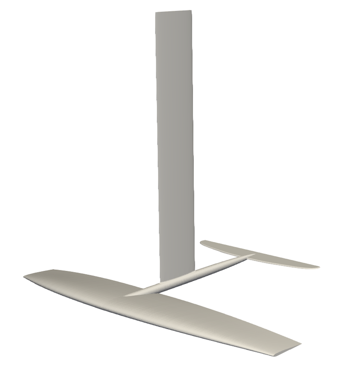

# CAAPS Workshop
This repository contains scripts for manual DIC evaluations and simulations with scikit-fem performed at the CAAPS workshop in February 2024.

## DIC
### Tensile test 
See Jupyter notebook `tensile.ipynb`

### Iosipescu shear test 
See Jupyter notebook `shear.ipynb`

## FEM 
The introduction of foils brought exiting innovation to many water sport activities, such as sailing, wind surfing and kite boarding. A particularly new activity called "wing foiling" emerged with the advent of new technologies and materials. During wing foiling, an athlete holds a kite-like wing in the hands for propulsion while standing on a surf board that is seemingly flying above the water surface. This is achieved with a underwater wing generating lift, which is connected to the board via a lightweight mast. 

In this workshop, we want to simulate the deformation of a carbon fiber reinforced wing foil mast under loading via finite elements. We will simplify the 3D geometry to a 2D rectangle in this workshop.

